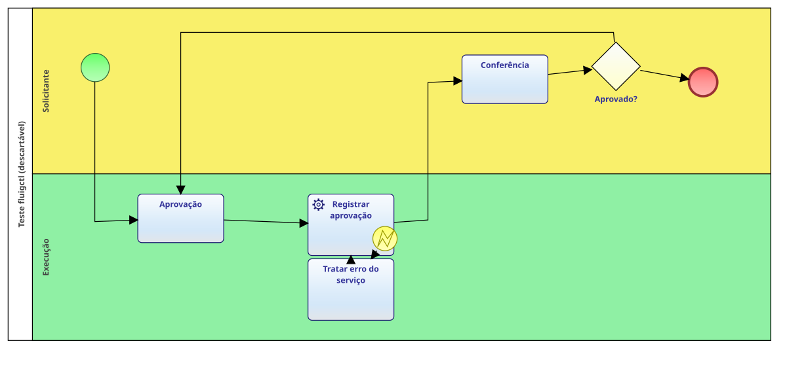

# fluigctl

Publica artefatos de um repositório TOTVS Fluig — datasets, formulários,
widgets, processos e os scripts de um processo — num servidor Fluig, pela linha de
comando, e baixa de volta scripts de processo, datasets e formulários. Faz o que o **Exportar** do Fluig Studio e da extensão Fluiggers do VS
Code fazem, sem IDE e sem clique, e serve igual para você no terminal e para um
agente (Claude Code, CI) via script.

## Por que usar

Publicar no Fluig é sobrescrever: o servidor grava o que receber, sem perguntar.
Os caminhos de sempre deixam fácil errar o alvo, apagar o que é do cliente ou
subir em produção sem querer. O `fluigctl` existe para que publicar seja
repetível e difícil de errar:

- **Não publica no lugar errado.** O formulário é resolvido pelo `--document-id`,
  pelo `.metadata` do Studio e só então pelo nome da pasta — e para quando há
  dúvida, listando os candidatos. O nome da pasta engana: no HML da Cetenco,
  `forms/formReembolso` é o formulário 902, e o que se chama "formReembolso" (676)
  é outro.
- **Não apaga o que é do servidor.** Num update mantém a descrição do dataset e o
  nome e o campo descritor do formulário, que o web service sobrescreveria.
- **Simula antes e prova depois.** Todo push tem `--dry-run`, que mostra o alvo e
  o que vai. No dataset, guarda uma cópia do código anterior e confere que o
  servidor devolve o código local.
- **Produção é humana.** Servidor marcado como produção exige a senha digitada
  num terminal de verdade. Um agente ou um script não consegue — por construção,
  não por convenção.
- **A senha não passa por quem chama.** Vem da variável de ambiente, de um
  arquivo próprio com permissão 600 ou do `.vscode/servers.json` da extensão,
  decifrado pela chave desta máquina. Nunca é impressa, e o `servers.json` é
  mantido no `.gitignore`.
- **Barato para um agente.** Comandos curtos e saídas de uma linha.

### Comparado com os outros caminhos

Medido em 02/10/2026 contra o HML da Cetenco, publicando o mesmo dataset e o
mesmo formulário por cada caminho (tokens: o que o agente precisa ler + o que
cada comando custa):

| | fluigctl | skill publicar-fluig | skill fluig-artefatos (curl) | Studio / Fluiggers |
|---|---|---|---|---|
| Uso por agente | sim | sim | sim, montando SOAP na mão | não (interface gráfica) |
| Tokens para 1 dataset + 1 formulário | ~1.900 | ~4.000 | ~12.000 (estimado) | — |
| Publicar dataset | 1,4 s | 1,0 s | — | — |
| Publicar formulário | 2,3 s | 2,4 s | — | — |
| Formulário sem `--document-id`, pasta `formReembolso` | 902 (certo, pelo `.metadata`) | 676 (errado, sem aviso) | o agente escolhe | pergunta |
| Mantém nome e descritor do formulário | sim | sim | depende do agente | sim |
| Produção a partir de um agente | bloqueada (exige TTY) | flags que o agente escreve | variável que o agente define | — |
| Cópia antes / conferência depois | dataset | não | checklist manual | não |
| Testes automatizados | 493 | não | não | — |

Fica para o Studio: diagrama com o que a conversão ainda recusa (o `--dry-run`
lista o motivo) e widget com código Java. Layout, evento global e mecanismo de
atribuição já são publicados pelo `fluigctl`.

## Estado

| | |
|---|---|
| `server add` / `ls` / `rm` / `test` / `set-prod` | pronto |
| `server ui` (tela no terminal para o cadastro) | pronto |
| `skill install` / `uninstall` (as skills que ensinam um agente a publicar e a escrever no padrão) | pronto |
| `diagram open` / `close` (visualizador local, vivo e somente leitura) | pronto |
| `diagram open` + modo de edição (renomear, mover, traçar ligações, propriedades, adicionar, ligar, remover, desfazer/refazer) | pronto: renomear, mover, traçar, propriedades, adicionar (com a service task com recuperação), ligar, remover, tamanho de raias e pool, e Organizar |
| `group ls` / `show` / `add` / `add-member` (grupos sem o painel do Fluig) | pronto |
| `process versions` / `release` (versões do processo e liberar a em edição) | pronto |
| `dataset run` (roda um dataset no servidor e mostra as linhas; só lê) | pronto |
| `request start` / `show` / `move` / `cancel` (solicitações sem a tela do Fluig) | pronto, conferido no localdev com a contratação: recuperação, laço de aprovação e reprovação |
| `diagram check` (confere um `.process` editado fora do Studio: referências do Graphiti, fluxos × formas, textos sem fonte, losangos sem pontos e formas sem o visual do Studio (`--fix` acrescenta), elementos sem saída ou sem entrada e o padrão das service tasks; `--fix` também devolve ao canto da tarefa a bolinha de erro que o Studio deixou solta) | pronto; os 96 `.process` salvos pelo Studio nos workspaces passam sem erro de estrutura |
| `server import` (servidores da extensão Fluiggers, e as senhas com `--with-passwords`) | pronto |
| `changed` (o que mudou no git, como comandos) | pronto |
| `push dataset` | pronto |
| `push form` | pronto |
| `push widget` | pronto (widgets sem Java) |
| `push layout` (layout WCM) | pronto; o `application.type` da pasta é conferido contra o comando |
| `push process` (scripts de um processo que já existe; `--base` para importar uma definição) | pronto |
| `push diagram` (o diagrama `.process` inteiro; `--create` para processo novo) | pronto, conferido no HML; 95 de 95 diagramas dos workspaces convertem |
| `pull process` / `pull dataset` / `pull form` (scripts de processo, código de dataset, anexos e eventos de formulário) | pronto |
| `pull diagram` (definição publicada → `.process`) | pronto: estados, atribuições, gateways, eventos, subprocessos, propriedades/configurações avançadas, componentes gráficos, raias, fluxos e bendpoints, com o visual do Studio em todos os tipos de forma do acervo (`npm run fidelidade-visual` compara com os 94 diagramas salvos pelo Studio) |
| `pull widget` (widget instalada → `wcm/widget/<code>`) | pronto; lê pela widget auxiliar do Fluiggers, que o `--instalar-helper` publica |
| `push event` / `pull event` (evento global, `events/<id>.js`) | pronto |
| `push mechanism` / `pull mechanism` (mecanismo de atribuição customizado, `mechanisms/<id>.js`) | pronto |

Fora de escopo por enquanto: `pull` de layout WCM (não há rota no servidor — veja
"Publicando um layout") e `push` de widget com código Java (a rota do WCM recusa —
veja "Widget com Java").

### Grupos e versões de processo

O que antes pedia o painel de administração do Fluig:

```sh
fluigctl group ls --server hml                     # os grupos do servidor
fluigctl group show suporte_processos --server hml # e quem está no grupo
fluigctl group add suporte_processos --server hml --description "Suporte de processos"
fluigctl group add-member suporte_processos joao.silva --server hml   # pelo login
fluigctl process versions contratacao --server hml # qual versão roda, quais ficaram em edição
fluigctl process release contratacao --server hml  # libera a versão em edição
```

- **Escritas conferidas:** criar grupo e pôr membro relêem o servidor. A resposta
  do Fluig é um XML livre, então só vale o que aparece na lista.
- **Produção:** passa pelo mesmo porteiro dos pushes, e `--dry-run` mostra o que
  seria feito.
- **Versões:** a lista vem do dataset interno `processDefinitionVersion`. O
  Fluig não tem operação para descartar uma versão em edição; liberar, tem.
- **Grupos no `push diagram`:** o push confere se os grupos do Pool Grupo e
  Grupo existem no destino e recusa antes de criar a versão. Sem essa
  conferência, a liberação falhava depois do import e a versão nova ficava presa
  em edição. O `--dry-run` só lista os grupos usados, porque ele não abre sessão.

### Rodando um dataset

```sh
fluigctl dataset run dsContratacaoCadastro --server hml --where LOGIN=admin
fluigctl dataset run colleague --server hml --where login~adm% --fields login,mail --json
fluigctl dataset run dsContratacaoAlcadas --server hml --where UNIDADE=Fabrica --where VALOR=8000 --limit 10
```

- **`--where`:** `campo=valor` (MUST), `campo!=valor` (MUST_NOT), `campo~valor`
  (`%` é curinga) e `campo=inicio..fim`. Repita para mais de uma restrição.
- **Só lê.** Passa pelo mesmo REST do `DatasetFactory` do navegador.
- **Dataset que não devolve nada:** o REST responde 200 com o conteúdo vazio
  tanto para dataset que não existe quanto para script que lançou erro. O
  `fluigctl` consulta a lista do servidor e diz qual dos dois aconteceu. Foi
  assim que apareceu o `getConstraintValue` faltando nos datasets da
  contratação: o dataset estava publicado e falhava com `ReferenceError`.

### Testando um processo: solicitações

```sh
fluigctl request start contratacao --server dev --field cargo=Analista --field salario=9000 --comment "teste"
fluigctl request move 14 --to 3 --server dev --wait          # e espera o job rodar as service tasks
fluigctl request show 14 --server dev --form                  # histórico, quem tem a tarefa, formulário
fluigctl request move 14 --to 6 --server dev --field decisaoAprovacao=aprovado --wait
fluigctl request cancel 11 --server dev --comment "teste encerrado"
```

- **`show`:** cada movimento com o estado, quem tinha a tarefa e a observação.
  É na observação que o Fluig grava a mensagem de falha da service task, então
  o `throw` do script aparece inteiro. `▶` marca a tarefa aberta.
- **`move`:** consome a tarefa aberta. Se ela estiver num pool
  (`Pool:Group:suporte_processos`), é assumida antes, senão o Fluig responde
  "Tarefa não encontrada". Com duas tarefas abertas (paralelo), diga qual com
  `--from <estado>`. A recusa do `validateForm` volta como texto.
- **`--wait`:** service task com execução posterior fica com `System:Auto` até
  o job do servidor rodar (uns 20 s no localdev). O `--wait` espera, até 180 s.
- **Versão:** a solicitação usa os scripts da versão em que foi aberta. Depois
  de corrigir um script e publicar, abra uma solicitação nova; a antiga continua
  com o script velho.
- **Escritas:** `start`, `move` e `cancel` passam pelo porteiro de produção e
  têm `--dry-run`. `cancel` pede o motivo e confere o status depois.

O que este teste achou na contratação, e que nenhum push acusava: o
`getConstraintValue` que faltava nos dois datasets; a consulta ao `colleague`
com o campo `fullName` (o nome é `colleagueName`) e uma restrição SHOULD vazia,
que devolviam zero linhas; e o `beforeTaskSave(sequenceId)`, cujo primeiro
parâmetro é o usuário, o que deixava o laço de aprovação sem fim.

## Instalação

```sh
npm install && npm run build
npm link            # deixa `fluigctl` no PATH
```

O `bin` do pacote é `bin/fluigctl.js`, um arquivo versionado que carrega o
compilado — e não o compilado direto. O `tsc` reescreve `dist/src/cli.js` sem o
bit de execução, então apontar o `bin` para lá fazia o `fluigctl` do PATH
responder "permissão negada" depois de qualquer `npm run build` ou `npm test`.
Com o wrapper versionado, recompilar não mexe no que está no PATH.

Node 22.2 ou mais novo.

### Para um agente

O repositório traz duas skills:

- `fluig-deploy` ensina um agente a publicar com o `fluigctl`: os comandos, os
  códigos de saída e as regras que ele não deve atravessar (produção é do humano).
- `fluig-patterns` ensina a escrever o artefato no padrão dos projetos: nomes,
  limites do Rhino, a linha STATUS/MESSAGE dos datasets, consultas ao RM, travas
  sem `disabled`, tarefas de erro nas service tasks, retentativas idempotentes.
  Ela foi tirada do repositório da Cetenco e das lições do histórico dele.

Uma vez:

```sh
fluigctl skill install    # põe as skills onde os agentes procuram
fluigctl skill            # diz onde elas estão, e se estão atualizadas
```

Elas saem como **link** para este repositório, e não como cópia: `git pull` aqui
atualiza o que o agente lê na próxima sessão. `--copy` copia, `--force` sobrepõe
uma skill de mesmo nome que não seja do `fluigctl`, e `--dir` escolhe o destino.

Sem argumento, o `install` põe em `~/.agents/skills/` (a convenção entre agentes)
e em `~/.claude/skills/` quando essa pasta já existe. `uninstall` só remove o que
ele mesmo pôs.

## Como usar

### 1. Cadastrar os servidores, uma vez

Se você já usa a extensão Fluiggers, traga os servidores e as senhas dela:

```sh
fluigctl server import ~/fluig/workspaces --with-passwords           # mostra o que faria
fluigctl server import ~/fluig/workspaces --write --with-passwords   # grava
fluigctl server ls
fluigctl server test cetenco-hml
```

Confira a marca de produção que o import listar (`fluigctl server set-prod <nome>`
corrige). Sem a extensão, cadastre à mão e ponha a senha no arquivo próprio:

```sh
fluigctl server add cetenco-hml --host homolog.cetenco.com.br --port 8021 --user integracao.fluig
echo "export FLUIG_CETENCO_HML_PASSWORD='...'" >> ~/.config/fluigctl/env && chmod 600 ~/.config/fluigctl/env
```

`server add` descobre `companyId` e `userCode` sozinho, consultando o servidor.

#### Pela tela do terminal

```sh
fluigctl server ui
```

Abre uma tela no terminal para fazer o mesmo sem decorar flags: cadastrar,
rever, testar, marcar produção, remover e importar. As teclas estão no próprio
rodapé, e a explicação de cada uma em `?`:

```
 fluigctl · servidores                                           2 cadastrados
────────────────────────────────────────────────────────────────────────────────
   NOME                   ENDEREÇO                                    USUÁRIO

 ▶ exemplo-hml            http://homolog.exemplo.com.br:8021          integracao
   exemplo-prod PRODUÇÃO  http://fluig.exemplo.com.br:8021            integracao

────────────────────────────────────────────────────────────────────────────────
 ↑↓ mover · ⏎ rever · a novo · t testar · p produção · ? ajuda · q sair
```

Quatro decisões de forma, para a tela ensinar em vez de exigir manual:

- **O formulário se anda com `⏎`**, e não só com `tab`: no último campo ele
  conclui, e o rodapé diz qual dos dois vai acontecer. O `ssl` não se digita —
  `espaço` alterna —, então não existe valor inválido nele. Os campos vazios
  mostram `—` e a dica do que o vazio significa (`vazio usa 80`).
- **O que é grave vem antes do que é comprido.** A marca `PRODUÇÃO` fica numa
  coluna logo depois do nome — perto de quem ela qualifica — e o corte, quando a
  tela é estreita, come a variável de senha primeiro, depois o usuário. O aviso
  que muda o comportamento do push não pode ser o primeiro a sumir.
- **Tela estreita perde coluna inteira, nunca meia palavra**, e o rodapé perde
  atalhos inteiros antes de perder os rótulos: `a t p x i ?` sem explicação não
  ajuda ninguém. Ele cabe a partir de 80 colunas.
- **Erro, sucesso e espera têm símbolo além de cor** (`✓ ✗ ! ⋯`): quem não
  distingue cor, ou está num terminal sem cor, continua entendendo.

Três decisões que valem saber:

- **O que é grave passa por confirmação.** Remover pede `s`, e marcar produção
  também — é a marca que faz o push exigir a senha digitada no terminal, e
  ligar isso sem querer muda o comportamento de todo push seguinte. Desligar não
  pede nada, porque não esconde perigo.
- **A senha digitada vai para o arquivo próprio (600)**, nunca para o
  `servers.json` — a mesma regra do `server import --with-passwords`. Deixar o
  campo vazio usa a variável de ambiente ou o `servers.json` da extensão, como o
  `server add`. A senha nunca aparece na tela: o formulário mostra só o tamanho.
- **O cadastro é provado antes de ser gravado**, na ordem do `server add`: o
  login roda primeiro e só depois o arquivo é escrito. Se a credencial não
  servir, o formulário continua ali com tudo o que foi digitado e o motivo,
  e nada é gravado.

**A janela pode ser redimensionada durante o uso**, e a tela se refaz sozinha, sem
esperar uma tecla. Isso custou uma medição: `columns`/`rows` de um `WriteStream`
sobre `/dev/tty` fica congelado no valor da abertura — o Node só mantém isso em
dia para `process.stdout`. Um `WriteStream` recém-criado, porém, lê o tamanho
atual (e `destroy` nele não fecha o fd), então é assim que o tamanho é lido: uma
vez na abertura, e outra a cada `SIGWINCH`.

A tela é uma frente do mesmo cadastro, não uma segunda implementação: ela chama
`addServer`, `removeServer`, `setProd`, `testServer` e `importCandidates`, os
mesmos que o CLI. E é para gente — precisa de um terminal de verdade, e recusa
com código 5 quando não há um (é o mesmo motivo do portão de produção).

O `enter` sobre um servidor abre o formulário preenchido para corrigir host,
porta, usuário e o resto. **Rever é tirar o antigo e gravar o novo** — com ou sem
troca de nome —, porque `addServer` recusa nome repetido de propósito: gravar por
cima do registro que está lá não passaria por essa checagem. O nome pode mudar,
e o antigo não fica para trás.

### 2. Acompanhar um diagrama enquanto ele muda

```sh
fluigctl diagram open workflow/diagrams/reembolso.process
```

Abre no navegador um visualizador local do `.process`. O servidor fica em
segundo plano e o comando devolve o terminal imediatamente, então um agente pode
abri-lo e continuar trabalhando. Quando o arquivo muda, o desenho muda sozinho.
Se uma gravação ficar temporariamente inválida ou o arquivo sumir, o último
desenho válido permanece e uma faixa explica o erro.

O desenho vem sempre do `.process`, nunca do `.processimage.svg` do Studio, que
pode estar velho. A interface enquadra o processo ao abrir, aceita zoom pela
roda, pan arrastando o fundo e tem o botão **Ajustar**.

Clique em qualquer pool, raia, atividade, evento, gateway, fluxo ou artefato
para destacá-lo e abrir o painel de propriedades. O painel traduz os campos
úteis e deixa atributos simples em **Detalhes técnicos**; blobs XML internos do
Studio nunca são enviados ao navegador. `Tab` percorre os elementos, `Enter` ou
espaço seleciona e `Esc` fecha. A seleção sobrevive a movimento, renomeação e
outras mudanças enquanto o ID existir.

Para automação sem navegador use `--no-open`; para depurar o servidor no processo atual,
`--foreground`.

Numa service task selecionada, **Ver script** abre ao lado do diagrama o
arquivo dela (`workflow/scripts/<processo>.<id>.js`, pelo `scriptFileName`),
com as linhas numeradas e o caminho para copiar. É só leitura, e funciona fora
do modo de edição também. Se o arquivo ainda não existe, o painel diz isso.

#### Modo de edição

O visualizador abre somente leitura. O botão **Editar** liga o modo de edição, e
**Sair da edição** volta. No modo de edição dá para:

- **renomear** pelo campo **Nome** do painel (abaixo);
- **mover** tarefas, eventos e gateways:
  - arrastando, com encaixe na grade de 10 px;
  - ou, com o elemento selecionado, pelas setas: 10 px, ou 50 px com `Shift`.

  O evento de erro preso a uma tarefa vai junto. Pool e raias não se movem, e um
  card não sai da pool. Quando o elemento muda de raia, ou o `diagram check`
  passa a acusar algo, o aviso diz;
- **traçar as ligações**: com um fluxo selecionado, as dobras viram quadrados
  arrastáveis (grade de 10 px). Clique duplo na linha cria uma dobra, e clique
  duplo num quadrado a remove. Também há os botões:
  - **Endireitar**: traça o fluxo em ângulos retos pela receita de layout.
    - Alvo à frente: degrau no meio do vão.
    - Retorno: pelo corredor 20 px acima.
    - Saída de evento de erro: fica a diagonal curta.
    - Um card no caminho: a linha contorna pelo corredor de cima dos elementos
      daquele trecho, ou por baixo se não houver espaço. Nenhuma linha cruza um
      card.
  - **Remover dobras**: deixa a linha reta de ponta a ponta.
  - **Endireitar ligações**: com uma tarefa, evento ou gateway selecionado,
    endireita todas as que entram e saem dele. É o passo natural depois de mover.
  - **Endireitar todas** (na barra do modo de edição): refaz todas as ligações
    do diagrama numa edição só. Um `Ctrl+Z` volta tudo, e o aviso diz quantas
    mudaram;
- **propriedades** no painel:
  - **Service task:** mostra o tipo de execução. Fora do padrão, oferece
    **Tornar automática** (`executionType="1"`). O painel não grava `0` nem `2`:
    nada no corpus diz o que o `2` significa.
  - **Tarefa humana:** a atribuição.
    - Mecanismos nativos: Pool Grupo, Grupo, Pool Papel, Usuário, Campo
      Formulário e Executor Atividade, cada um com o seu campo.
    - Mecanismo customizado, com sugestões da pasta `mechanisms/` do workspace.
    - Nenhum.
    - "Associado" aparece, mas não se edita.
  - **Gateway:** a condição de cada saída.
    - Por regra: campo do formulário, igual a ou diferente de, valor. Várias
      regras se somam com "e".
    - Ou por expressão.
    - Os operadores sem valor do Studio (0 e 9) aparecem, mas não se criam.
    - Gateway com atribuição por caminho fica somente leitura.

  Atribuição e condição moram em blobs XStream dentro de um atributo. Elas só se
  regravam no formato exato do Studio, e o painel as deixa somente leitura
  quando a ida e volta não reproduz o blob. Nos 105 `.process` dos workspaces:
  - regravar sem mudança devolve os 6.179 atributos idênticos;
  - os metadados que o Studio deixa ficam preservados (expressão antiga,
    `sequence`, ordem);
  - o estilo de codificação do arquivo é respeitado (`&#xA;` ou `&#10;`, `>` ou
    `&gt;`);
- **adicionar** pelo menu **+ Adicionar…**: escolha o tipo e clique no
  diagrama onde ele vai ficar (`Esc` cancela). O elemento já vem selecionado,
  com o campo Nome em foco.
  - Tipos: tarefa humana, gateway exclusivo, gateway paralelo (abre), junção
    paralela (fecha), início, fim, service task sozinha, e **service task com
    recuperação**. O temporizador fica para depois: ele exige configurar o
    gatilho no painel.
  - A **service task com recuperação** cria o padrão inteiro de uma vez:
    - a tarefa automática;
    - o evento de erro no canto inferior direito;
    - o tratamento 33 px abaixo, no Pool Grupo `suporte_processos`;
    - as duas ligações.

    Renomear a service task leva junto os nomes que a criação gerou
    ("Erro: …", "Tratar erro: …"), mas não um nome mudado à mão.
  - A forma nova é clonada de uma do mesmo tipo do próprio arquivo, então sai no
    estilo dele. Ela vai para o fim da lista, sem mudar a posição de nada que
    já existe, e ganha um id com número inédito.
  - Nos 93 `.process` dos workspaces com pool, criar cada tipo e a recuperação
    não gerou erro de estrutura nem piorou a conversão do `push`.
  - A service task nova ganha o script dela em
    `workflow/scripts/<processo>.<id>.js`, com um esqueleto no padrão da skill
    `fluig-patterns`. Não é uma função vazia:
    - o cabeçalho de sempre;
    - um comentário dizendo que falta implementar e lembrando o padrão de
      recuperação e a idempotência;
    - um log de aviso e um registro no histórico da tarefa.

    Desfazer apaga o script, se ele continua como foi gerado; um script que você
    já editou fica, e o aviso diz. Refazer o recria. Um arquivo que já existe
    nunca é sobrescrito. Fora do layout `workflow/diagrams/`, nenhum script é
    criado;
- **ligar** dois elementos, de dois jeitos:
  - com uma tarefa, evento ou gateway selecionado, arraste a alça azul à direita
    dele até o destino;
  - ou **Ligar a…** no painel, e um clique no destino (`Esc` cancela).

  A ligação nova já nasce traçada pela receita e fica selecionada para você dar
  o nome. Se a origem é um gateway, o aviso lembra de definir a condição da
  saída. O fim não tem saída, o início não tem entrada, e uma ligação repetida
  é recusada;
- **remover** o elemento ou a ligação selecionada, pelo botão **Remover** do
  painel ou pela tecla `Delete`:
  - **O que sai junto:** as ligações do elemento; numa service task, também o
    evento de erro preso a ela. O tratamento fica, e você remove se quiser.
  - **Limpeza:** a condição de gateway para um destino que perdeu o fluxo também
    sai. Uma condição para um destino sem fluxo o `push` não publica.
  - **Renumeração:** o desenho referencia tudo por posição, então toda
    referência a um item depois do removido é renumerada, e a que apontava para
    ele sai das listas.
  - **Recusas, com o motivo:**
    - pool e raias;
    - um elemento que outra tarefa usa na atribuição (Executor Atividade);
    - um lado só de um par de eventos de link;
    - um gateway cujas condições o painel não regrava.
  - **O script de uma service task removida fica no disco:** é código seu, e o
    aviso diz qual é.
  - **Validação:** removi, um de cada vez, cada um dos 4.815 elementos e fluxos
    dos 105 `.process` dos workspaces. Foram 150 recusas com motivo, nenhum erro
    de estrutura e nenhuma piora na conversão do `push`;
- **tamanho de raias e da pool**: com uma raia selecionada, o painel mostra a
  altura dela e a largura da pool, e há uma alça na borda de baixo da raia para
  arrastar.
  - **Altura da raia:** o que está abaixo dela (raias, elementos e dobras)
    desce ou sobe junto, e a pool acompanha.
  - **Largura da pool:** as raias acompanham.
  - **Encolher** é recusado se cortaria um elemento que hoje cabe inteiro, ou
    deixaria um de fora da pool.
  - **Validação:** nos 105 `.process`, aumentar e voltar cada uma das 296 raias
    e a largura das 93 pools devolve o arquivo idêntico, sem erro de estrutura
    nem piora na conversão do `push`;
- **Organizar** (barra do modo de edição): reorganiza o diagrama inteiro pela
  receita de layout da skill, sem spec escrita à mão. É uma edição só, e um
  `Ctrl+Z` volta tudo.
  - **Ordem cronológica** da esquerda para a direita, a partir do início. Os
    retornos não contam.
  - **Raias:** cada elemento fica na raia em que estava, porque a raia é o
    papel. Na mesma raia e na mesma coluna, o segundo desce para uma linha de
    ramo, e um ramo continua na própria linha.
  - **Pares da recuperação:** bolinha no canto e tratamento 33 px abaixo.
  - **Tamanhos:** cada raia do tamanho do conteúdo, e a pool acompanha.
  - **Ligações:** traçadas pela rota da receita. Os fluxos curtos são traçados
    primeiro. Trilhos de origens e destinos diferentes não correm um em cima
    do outro; dividir o trilho só vale para as saídas do mesmo elemento, e
    juntar, para as chegadas no mesmo elemento.
  - **Estabilidade:** organizar duas vezes dá o mesmo resultado.
  - **Validação:** nos 105 `.process`, nenhuma falha, nenhum erro de estrutura,
    nenhuma piora na conversão do `push` e nenhum erro de padrão novo. As
    sobreposições de cards caem de 15 para 0, e as linhas que cruzam cards, de
    78 para 37;
- **desfazer e refazer** até 30 edições, pelos botões ou com `Ctrl+Z` e
  `Ctrl+Shift+Z`. Salvar sem mudança não grava nem ocupa o histórico.

Não há botão de salvar para o diagrama: cada edição é gravada no `.process` na
hora. O selo na barra do modo de edição diz o que aconteceu:
- **Salvando…** enquanto grava;
- **Salvo às 10:42:15**, em verde, quando gravou;
- **Não salvo**, em vermelho, quando a edição foi recusada (passe o mouse para
  ver o motivo);
- **Alterações não salvas**, em amarelo, quando um campo do painel (nome,
  atribuição, condições) foi alterado e ainda falta o botão Salvar dele. Fechar
  a aba nesse estado pede confirmação.

Toda edição passa pelo mesmo caminho:
1. **Hash da tela.** A edição só vale sobre o texto que a tela desenhou. Se o
   arquivo mudou nesse meio-tempo, ela é recusada e a tela se atualiza.
2. **Troca de texto.** Só o atributo editado muda (`name`, o `x`/`y` da forma,
   as `<bendpoints>` do fluxo, ou o atributo da propriedade), sem reserializar o XML.
3. **Conferência.** O resultado precisa ser relido, e o `diagram check` não pode
   acusar erro de estrutura que o arquivo não tinha.
4. **Escrita atômica.**

As linhas ligadas a um elemento movido mantêm as dobras que tinham, como no
Studio. Use **Endireitar ligações** para refazê-las.

#### Renomear pelo painel

O campo **Nome** do painel, no modo de edição, grava no `.process`. `Ctrl`+`Enter` ou **Salvar** confirma, **Cancelar** volta
atrás, e nada é escrito enquanto você digita.

A gravação troca apenas o atributo `name` daquele objeto: espaços, ordem,
entidades e geometria ficam byte a byte iguais, e o arquivo é substituído
atomicamente. Se o arquivo estiver num link simbólico, a escrita atravessa o
link em vez de trocá-lo por um arquivo comum.

**Conflito não é sobrescrito.** Se o agente mexeu no arquivo nesse meio-tempo, o
visualizador não grava:

- nome alterado pelo agente: o painel mostra o valor com que você começou, o que
  está no arquivo agora e o que você digitou, e oferece só **Usar o valor do
  arquivo**;
- elemento removido: nada é recriado;
- arquivo trocado durante o salvamento: o salvamento é repetido por você.

Depois de salvar aparece **Desfazer**, que restaura a versão anterior (e
**Refazer** depois dele). Os dois só funcionam enquanto o arquivo continuar
exatamente como a edição o deixou — se
o agente escreveu qualquer coisa depois, o desfazer recusa, para não apagar o
trabalho dele. A versão anterior fica no diretório de estado do `fluigctl`
(`~/.local/state/fluigctl/edicoes/`), não no workspace: nunca aparece um `.bak`
no projeto.

A escrita é um `POST` que exige o token da própria instância e uma origem local,
e só alcança o arquivo que foi aberto. Uma página de outro site aberta no seu
navegador não consegue editar o diagrama: ela não tem o token e a origem dela é
recusada.

Cada instância escuta apenas em `127.0.0.1`, numa porta aleatória, e exige um
token aleatório na URL. Um segundo `open` do mesmo arquivo reutiliza a instância.
Para encerrá-la:

```sh
fluigctl diagram close workflow/diagrams/reembolso.process
```

### 3. No dia a dia: ver o que mudou, simular, publicar

Rode na raiz do repositório Fluig:

```sh
fluigctl changed --server cetenco-hml
```

Para cada artefato alterado, ele imprime o comando com `--dry-run`. Rode a
simulação, leia os `aviso:` e o alvo, e repita sem `--dry-run`:

```sh
fluigctl push dataset datasets/reembolso/dsFoo.js --server cetenco-hml --dry-run
fluigctl push dataset datasets/reembolso/dsFoo.js --server cetenco-hml

fluigctl push form forms/formReembolso/ --server cetenco-hml --keep-version --dry-run
fluigctl push form forms/formReembolso/ --server cetenco-hml --keep-version

fluigctl push process reembolso --server cetenco-hml --dry-run
fluigctl push widget wcm/widget/wdgAniversariantes --server cetenco-hml --dry-run

fluigctl push event events/afterProcessCreate.js --server cetenco-hml --dry-run
fluigctl push mechanism mechanisms/MEC_ALCADAS.js --server cetenco-hml --dry-run

# trazer um diagrama simples publicado de volta para um arquivo do Studio
fluigctl pull diagram reembolso --server cetenco-hml --dry-run
fluigctl pull diagram reembolso --server cetenco-hml
```

O `pull diagram` nunca gera um arquivo parcial: condições, gatilhos,
subprocessos, segurança e regras de anexos, campos descritores, configuração
mobile, propriedades estendidas e componentes gráficos são reconstruídos. Se a
definição trouxer um tipo ou uma referência incoerente que não possa ser
representada no `.process`, ele recusa antes de gravar.

Formulário exige escolher a versão: `--keep-version` sobrescreve a ativa (só
mudou JS, CSS, texto), `--new-version` cria a próxima (ganhou campo — o servidor
recusa campo novo com `--keep-version`). Na dúvida sobre o alvo, passe
`--document-id`.

Criar artefato novo é sempre explícito:

```sh
fluigctl push dataset datasets/dsNovo.js --server cetenco-hml --create --description "Novo"
fluigctl push form forms/formNovo --server cetenco-hml \
  --create --parent-id 5 --dataset-name dsformNovo --persistence-type form
```

### 3. Produção

O mesmo comando, num terminal seu: o `fluigctl` pede a senha antes de enviar.
Um agente não sobe em produção — ele te entrega o comando.

## Importando servidores da extensão

```sh
fluigctl server import ~/fluig/workspaces                                  # mostra o que faria
fluigctl server import ~/fluig/workspaces --write                          # grava os servidores
fluigctl server import ~/fluig/workspaces --write --with-passwords         # e copia as senhas
```

Traz os servidores dos `.vscode/servers.json` da extensão Fluiggers.
Deduplica pelo que identifica um servidor — host, porta, ssl e usuário —
porque o mesmo Fluig costuma aparecer em vários projetos com nomes diferentes.

Com `--with-passwords`, decifra a senha de cada servidor (ver "Segredos") e a
copia para `~/.config/fluigctl/env`, sem imprimi-la. Sem `--write`, só lista o
que copiaria. Em qualquer caso, confere o git de cada repositório onde achou um
`servers.json`: com `--write`, acrescenta `.vscode/servers.json` ao `.gitignore`
que não o tiver; se o arquivo já estiver **versionado**, avisa — ignorar não o
tira do histórico.

A marca de produção vem do nome do servidor, o que é palpite: o import lista
tudo que **não** marcou e pede revisão. Corrija com `server set-prod <nome>`.

## Segredos

`~/.config/fluigctl/servers.json` nunca contém senha. Guarda host, porta,
usuário, `companyId`, `userCode` e o **nome** da variável que a contém,
derivado do nome do servidor (`cetenco-prod` → `FLUIG_CETENCO_PROD_PASSWORD`).
O arquivo pode ser lido, versionado e inspecionado sem expor credencial.

A senha vem, nesta ordem:

1. a variável de ambiente;
2. `~/.config/fluigctl/env`, no formato de shell, se a variável não estiver
   definida;
3. o `.vscode/servers.json` da extensão Fluiggers, procurado da pasta atual
   para cima, no servidor de mesmo host, porta, ssl e usuário.

A extensão grava a senha em AES-256-CBC com chave derivada (scrypt) do
`telemetry.machineId` do VS Code — o do `storage.json` do perfil (VS Code,
Insiders, Cursor ou VSCodium). O `fluigctl` decifra com a chave desta máquina;
senha cifrada noutra máquina não abre, e o servidor é pulado. Ao usar essa
fonte, ele diz de qual arquivo leu, acrescenta `.vscode/servers.json` ao
`.gitignore` do repositório e sugere copiar a senha para o arquivo próprio com
`server import --with-passwords`. `FLUIGCTL_NO_VSCODE=1` desliga a fonte 3.

```sh
# ~/.config/fluigctl/env   (chmod 600)
export FLUIG_CETENCO_HML_PASSWORD='...'
export FLUIG_CETENCO_PROD_PASSWORD='...'
```

O arquivo existe porque exportar a variável a cada sessão não funciona para
processos não interativos — um shell zsh não interativo lê `.zshenv`, não
`.zshrc`. Quem lê o arquivo é sempre o CLI. O `fluigctl` avisa se ele estiver
acessível a outros usuários.

## Produção

Um servidor cadastrado com `--prod` exige que a senha seja digitada no terminal
antes de cada push. A senha digitada é comparada com a da variável de ambiente
(`crypto.timingSafeEqual`) e serve só como autorização — quem vai no SOAP é
sempre a do ambiente.

O prompt abre `/dev/tty` diretamente e recusa qualquer coisa que não seja um
terminal de verdade. **Sem TTY, o push em produção falha com código 5.** Isso
significa que um processo não interativo — um script de CI, um agente — não
consegue subir em produção. É uma garantia estrutural, não uma convenção.

## Publicando um formulário

O `documentId` é resolvido nesta ordem, e cada fonte é conferida contra o
catálogo do servidor antes de valer:

1. `--document-id N`
2. o prefixo numérico da pasta (`721291 - Aprovadores`) — aceito só se a
   descrição no servidor também bater; se apontar para outro formulário, o
   push para, porque isso costuma ser pasta copiada de outro projeto
3. o `.metadata` do Fluig Studio na pasta — a lista das exportações já feitas,
   cada uma com o documentId. Vale a exportação cujo documentId existe neste
   servidor **e** é o mesmo formulário (mesmo dataset ou mesma descrição): os
   ids não valem de um ambiente para outro. Sobrando mais de uma, desempata o
   servidor da última exportação; sem desempate, para e lista
4. o nome da pasta contra `documentDescription`

O passo 3 existe porque o nome da pasta engana: no HML da Cetenco,
`forms/formReembolso` é o 902 ("formSolicitacaoReembolso"), e o 676, que se
chama "formReembolso", é outro formulário — o push por nome publicou nele.

Num update, o **nome** e o **campo descritor** do formulário ficam os que estão
no servidor. O web service grava o que receber, e mandar o nome da pasta e o
descritor vazio renomeava o formulário e apagava o descritor (o 392 do HML usa
`nomeFantasia`). Mude-os só de propósito, com `--description` e
`--description-field`. O dry-run mostra o nome e o descritor que vão.

Com duas correspondências, o push para e lista os candidatos. Sem nenhuma,
pede `--create` com `--parent-id`, `--dataset-name` e `--persistence-type` —
nada disso é adivinhado, porque `persistenceType` não existe na operação de
atualização e um erro na criação não tem conserto por essa via.

### Versão

Atualizar um formulário **exige** escolher, e a recusa acontece antes de
qualquer chamada de rede:

| flag | efeito |
|---|---|
| `--keep-version` | sobrescreve a versão ativa no lugar |
| `--new-version` | cria a próxima versão; a anterior continua legível |

Não há default. Sobrescrever a versão ativa é irreversível, e isso não pode
ser o que acontece quando ninguém disse nada — o `fluigctl` roda tanto na sua
mão quanto na de um agente, e o silêncio de um script não é consentimento.

`--create` não aceita essas flags: `versionOption` não existe na operação de
criação.

Medido no servidor: as versões andam de mil em mil (1000 → 2000 → 3000) e o
conteúdo antigo continua acessível por `getCardIndexContent`, então
`--new-version` dá rollback de verdade.

Vão como anexo todos os arquivos da pasta, com o caminho relativo preservado,
**exceto** `events/` (que vira `customEvents`, em texto puro), o `.metadata` do
Eclipse e dotfiles. Anexo com nome fora do ASCII gera aviso: há servidor que
recusa o formulário inteiro por isso (o Fluig local recusou um `.md` com acento
no nome), e então o erro diz qual arquivo renomear. O arquivo principal é o `.html` único da raiz, ou o que
tiver o nome da pasta, ou o que você indicar em `--principal`.

Rodado contra as 657 pastas de formulário reais dos 12 workspaces: 646 lidas
sem erro, 11 recusadas com motivo — 8 sem `.html` nenhum e 3 com dois `.html`
sem desempate. Nenhuma publicaria o `.metadata` junto.

## Publicando um dataset

Num update, antes de escrever, o `fluigctl` lê do servidor o código e a
descrição atuais (`loadDataset`):

- a descrição é preservada, a menos que venha `--description`;
- o dry-run diz se o servidor já tem exatamente este código;
- o código que estava lá é copiado para
  `~/.local/state/fluigctl/backups/<host>/datasets/<nome>.<data>.js`
  (`$XDG_STATE_HOME` se definido) — é o rollback;
- depois do envio, lê de novo e confere que o servidor devolve o código local.
  Se não devolver, sai com código 7 e aponta a cópia.

## O que mudou no git

```sh
fluigctl changed --server cetenco-hml                # working tree
fluigctl changed --since main --server cetenco-hml   # desde um commit ou branch
```

Traduz os arquivos alterados em artefatos (dataset, formulário, scripts de
processo, widget) e imprime o comando de **cada um**, com `--dry-run`. Não envia
nada: publicar em lote é como se sobrescreve, sem querer, o que outra pessoa
mudou no servidor. Para formulário, compara os `name="..."` do HTML com a
versão anterior e sugere `--new-version` quando há campo novo. Para diagrama
alterado sugere `push diagram`, que já publica os scripts do processo — por isso
os scripts dele não ganham um `push process` à parte, que criaria outra versão.
Os arquivos de `workflow/.resources` (gerados pelo Studio ao exportar) aparecem só
como informação.

## Baixando do servidor

```sh
fluigctl pull process reembolso --server cetenco-hml --dry-run
fluigctl pull process reembolso --server cetenco-hml
fluigctl pull dataset dsFoo --server cetenco-hml
fluigctl pull form forms/formFoo --server cetenco-hml --dry-run
fluigctl pull widget --server cetenco-hml                       # lista as instaladas
fluigctl pull widget wdgAniversariantes --server cetenco-hml --dry-run
fluigctl pull event --server cetenco-hml                        # todos os eventos globais
fluigctl pull mechanism MEC_ALCADAS --server cetenco-hml --dry-run
```

O caminho inverso do push, para trazer ao repositório o que alguém publicou
direto no servidor. Só lê do servidor.

- `pull process` grava cada evento da definição publicada em
  `workflow/scripts/<prefixo>.<evento>.js`, com o mesmo prefixo do `push process`
  (o nome do `.process` com este id, ou o próprio id). Diagrama e atividades ficam
  de fora.
- `pull dataset` grava no `datasets/**/<nome>.js` que o repositório já tem — em
  qualquer subpasta — ou, sem nenhum, em `datasets/<nome>.js`. Dois arquivos com o
  nome são recusados (código 6), e dataset de fábrica (`BUILTIN`, que não tem
  código JavaScript) também.
- `pull form` resolve o formulário como o `push form` (`--document-id`, prefixo da
  pasta, `.metadata` do Studio, nome — leia os `aviso:`) e baixa a versão ativa. O
  servidor guarda os anexos só pelo nome, então cada um vai para o arquivo local de
  mesmo nome em qualquer subpasta (`libs/select2.min.js`) ou, se não houver, para a
  raiz da pasta; os eventos vão para `events/<evento>.js`. Anexos são comparados
  byte a byte (imagens vêm intactas). Arquivo que só existe no local é listado e
  fica como está. A pasta pode não existir ainda: é criada.
- `pull widget` baixa o `.war` instalado e desmonta em `wcm/widget/<code>`, a
  mesma pasta que o `push widget` lê — incluindo `pom.xml` e `src/main/java` de
  um pacote compilado, que o push recusa republicar sem o build do Maven. Sem o
  código, o comando só lista as widgets instaladas. As entradas do `.war` que não
  têm lugar na pasta (o `META-INF/MANIFEST.MF`, que o empacotamento refaz) são
  listadas na saída, nunca descartadas em silêncio.
- `pull event` e `pull mechanism` trazem os eventos globais para
  `events/<eventId>.js` e os mecanismos customizados para `mechanisms/<id>.js` —
  os mesmos arquivos que o `push` lê. Sem o id, trazem todos. O nome e a
  descrição de um mecanismo ficam no servidor e não têm onde ir no repositório,
  então o `push` os preserva de lá.

### Publicando evento global e mecanismo de atribuição

Duas famílias que não vêm do Studio: o evento global é um `.js` solto em
`events/`, e o mecanismo customizado é um `.js` com `resolve(process, colleague)`
em `mechanisms/`. As duas publicam por REST, como o dataset:

```sh
fluigctl push event events/afterProcessCreate.js --server cetenco-hml --dry-run
fluigctl push mechanism mechanisms/MEC_ALCADAS.js --server cetenco-hml --dry-run
```

**O `saveEventList` do Fluig substitui a lista inteira de eventos globais.** Não
existe rota para gravar um evento só: mandar um apagou o outro, medido no
fluig-localdev. Por isso toda publicação lê a lista, troca a entrada e manda a
lista de volta — e uma leitura que falha **recusa** em vez de virar lista vazia,
que apagaria todos os eventos do cliente. A extensão Fluiggers, que faz o mesmo
caminho, devolve lista vazia quando a leitura falha: é por aí que ela perde os
eventos dos outros.

Um mecanismo tem campos que não vêm de arquivo nenhum — `name`, `description`,
`controlClass`, `assignmentType`, `configurationClass`. No update o corpo é o
objeto que o servidor devolveu, com só o código trocado; `--name` e
`--description` são a exceção explícita. Criar é `--create`, e sem `--name` o nome
fica sendo o id.

Depois de enviar, os dois conferem: releem e comparam com o arquivo local, como o
`push dataset` faz. O evento global é **compilado pelo servidor** na gravação, e o
erro de sintaxe volta com o nome do evento e a linha.

### Lendo widget: a widget auxiliar do Fluiggers

O Fluig não expõe serviço para baixar o `.war` de uma widget instalada. A
extensão Fluiggers resolve isso publicando uma widget própria no servidor, a
`fluiggersWidget`, que serve a lista e os pacotes por três rotas
(`/fluiggersWidget/api/...`). O `fluigctl` lê pela mesma rota, e por isso
`pull widget` depende dela.

Sem a auxiliar no servidor, o comando recusa e aponta o caminho:

```sh
fluigctl pull widget wdgAniversariantes --server cetenco-hml --dry-run
#   recusa: falta a widget auxiliar
fluigctl pull widget wdgAniversariantes --server cetenco-hml --instalar-helper
```

O `--instalar-helper` **publica uma widget no servidor** — não é leitura. Por
isso é explícito, sai da lista de comandos que o agente pode rodar sozinho, e em
servidor marcado como produção passa pelo mesmo portão de senha do push. É a
mesma restrição da extensão, que só instala a auxiliar quando você pede.

Arquivo novo é gravado; igual ao servidor (a comparação ignora fim de linha e
espaço no fim, como a do push) fica como está; diferente só é trocado com
`--overwrite`. Sem ele, se algum diferir, **nada** é gravado e a saída é 6,
listando os arquivos — para não deixar a pasta metade do servidor e metade local.
O `--dry-run` lista novos, iguais e diferentes sem gravar.

Ciclo conferido no fluig-localdev, com a `portalMedicaoContratos` da Cetenco:
`pull widget --instalar-helper` baixou e desmontou os 15 arquivos, e a árvore
saiu **idêntica à pasta do workspace**, com uma única diferença acrescentada pelo
próprio servidor no deploy (`application.tenant.code=1`). Publicando essa árvore
de volta com `push widget` e baixando outra vez, os 15 arquivos saem como
`iguais` — o ciclo converge.

## Publicando um widget

`push widget` recebe a pasta da widget (`wcm/widget/<nome>`), monta o `.war` em
memória — sem Maven — e envia pelo mesmo endpoint da extensão Fluiggers,
`/portal/api/rest/wcmservice/rest/product/uploadfile`, com a sessão do portal.
O nome da widget é o nome da pasta. Não há `--create`: o servidor instala se a
widget não existe e atualiza se existe.

**Quem escolhe o alvo é o `application.code`, não o nome da pasta nem o do
arquivo.** Medido no fluig-localdev: um pacote enviado como
`DSA001semClasses.war` foi registrado como `DSA_001_java_gestao_contrato`, que é o
`application.code` do `application.info`. O `push` lê esse campo, publica com a
identidade dele e avisa quando a pasta tem outro nome:

```
[dry-run] genteQueCresce.war — 12 arquivo(s), 16309 bytes seria enviado para …
  aviso: a pasta se chama "pasta-renomeada" e o application.code é "genteQueCresce": o push publica "genteQueCresce".
```

Sem `application.code` o comando recusa antes da rede (código 3): o servidor não
identifica a aplicação, e responde um `UploadErrorException` seco — medido.

O pacote segue o mapeamento da extensão, sem compressão:

| origem | no `.war` |
|---|---|
| `src/main/webapp/WEB-INF/*.xml` | `WEB-INF/` |
| `src/main/resources/*.*` | `WEB-INF/classes/` |
| `src/main/webapp/resources/**` | `resources/`, com as subpastas |

Diferenças de propósito em relação à extensão:

- todos os arquivos vão em bytes crus — a extensão lê `src/main/resources`
  como UTF-8 e corrompe `.properties` gravado em latin1;
- `.metadata` e dotfiles ficam de fora, como no `push form`;
- pasta sem `src/main/webapp/WEB-INF` ou sem
  `src/main/resources/application.info` é recusada com código 3;
- widget com arquivo em `src/main/java` é recusada com código 6, antes de
  qualquer chamada de rede. Compilado ou não: **a rota de upload do WCM recusa
  um `.war` com classes** (veja "Widget com Java" abaixo).

`--dry-run` monta o pacote e mostra nome, número de arquivos, tamanho e a URL
de destino, sem abrir sessão nem enviar nada.

**A instalação é assíncrona.** Uma resposta de sucesso quer dizer que o servidor
aceitou o `.war`; a widget é instalada ou atualizada em segundo plano, e o
`fluigctl` não espera por isso. Uma resposta com `message` é erro do servidor e
sai com código 7.

Rodado (só o empacotamento) contra as 160 entradas de `wcm/widget/` dos
workspaces: 147 empacotadas, todas aprovadas por `unzip -t`; 7 recusadas por
terem Java; 6 recusadas por não serem pasta de widget (dois `.zip`, um `.txt`,
duas pastas só com `target/` e uma sem `WEB-INF`).

## Widget com Java

Não é possível publicar pelo `fluigctl`, e isso foi medido, não suposto.

O `push widget` sempre recusou `src/main/java`, e a primeira versão deste texto
dizia que era só porque o `fluigctl` não compila Java. Não é só isso: depois de
compilar, **a rota de upload recusa o pacote**. Testado no fluig-localdev com o
`DSA_001_java_gestao_contrato` da Doisa, cujas 6 classes estão em
`src/main/java`:

| pacote enviado | resposta |
|---|---|
| o mesmo `.war` **sem** as classes | `200 {"content":"OK"}` |
| com as classes em `WEB-INF/classes/com/fluig/**` | `500 Existe uma declaração de componente repetida na lista de recursos da widget` |
| com **uma só** classe | mesmo erro |
| com o pacote renomeado para `com/exemplo/**` | mesmo erro |
| com as classes num `.jar` em `WEB-INF/lib` | mesmo erro |
| com a classe na raiz do `.war` | mesmo erro |
| com `META-INF/MANIFEST.MF` declarando `Dependencies: org.slf4j, com.fluig.api, com.fluig.api.common` (o que o `pom.xml` do widget declara) | mesmo erro |

Ou seja: a rota não aceita artefato Java em lugar nenhum do pacote. Widget com
Java é pelo Fluig Studio.

**E não vale empacotar sem as classes para “funcionar”.** É o que a extensão
Fluiggers faz, e é um defeito dela: no import ela escreve as classes em
`src/main/java` (`WEB-INF/classes/<pacote>/…` → `src/main/java/<pacote>/…`), e no
export ela empacota só `WEB-INF/*.xml`, `src/main/resources/*.*` e
`src/main/webapp/resources/**` — **as classes ficam de fora**. Republicar uma
widget com Java por ela sobe uma versão sem o Java, em silêncio. O `fluigctl`
recusa em vez disso.

O `pull widget` continua funcionando para uma widget com Java: o `.war` é baixado
e desmontado, com as classes em `src/main/java` (e o `pom.xml`, que vem do
pacote). O que não dá é republicar por aqui.

## Publicando um layout

```sh
fluigctl push layout wcm/layout/layoutExterno --server cetenco-hml --dry-run
```

Para o servidor, widget e layout são a mesma coisa: uma aplicação WCM com
estrutura Maven idêntica, o mesmo pacote e a mesma rota de upload. O
`push layout` monta o `.war` exatamente como o `push widget` — mesmo mapeamento,
mesmas recusas — e o que os separa é o `application.type` do
`src/main/resources/application.info`.

Esse campo não é decoração: **sem a conferência, `push widget` numa pasta de
layout sobe o layout como se fosse widget, e o servidor aceita.** Medido no
fluig-localdev. Por isso o `push widget` exige `application.type=widget` e o
`push layout` exige `application.type=layout`; pasta sem o campo é recusada com
instrução, e pasta do outro tipo recusa dizendo qual é o comando certo.

A publicação foi conferida no fluig-localdev com o `layoutExterno` da Cetenco:
antes do envio, `/layoutExterno/resources/js/layoutExterno.js` respondia `404`;
depois, `200`.

**`pull layout` não existe, e não é só falta de trabalho:** o Fluig não expõe
rota para listar ou baixar layout. A widget auxiliar do Fluiggers, que é como o
`pull widget` lê, consulta o banco com
`WHERE APPLICATION_TYPE = 'widget'` e não tem controlador de layout — os layouts
moram na mesma tabela, com outro tipo, mas fora do alcance dela.

## Publicando um diagrama

```sh
fluigctl push diagram workflow/diagrams/meuProcesso.process --server cetenco-hml \
  --dry-run --save-xml /tmp/meuProcesso.xml                                         # converte, sem rede
fluigctl push diagram workflow/diagrams/meuProcesso.process --server cetenco-hml   # publica
fluigctl push diagram workflow/diagrams/novo.process --server cetenco-hml --create  # processo novo
```

Converte o `.process` no XML que o servidor importa (o formato do
`.ecm30.xml` do Studio). O `--dry-run` não abre sessão: do servidor só usa o
`companyId` do cadastro; `cardIndex` numérico vira o `formId`, um nome fica 0,
com aviso.

**Um diagrama nunca é publicado nem republicado sem formulário.** `cardIndex`
vazio (ou 0) no processo é recusado com código 6, já no `--dry-run` e antes de
qualquer chamada ao servidor: processo sem formulário abre no portal com
"Formulário inexistente". Vincule no Studio ou ponha no `cardIndex` o documentId
de um formulário do servidor.

Publicar converte primeiro (o que não converte nem abre sessão) e confere o
destino: o processo tem de existir, ou vir `--create`; o formulário do
`cardIndex` tem de existir (número) ou casar com um único formulário (nome);
cada processo chamado como subprocesso tem de existir; e o volume do processo e
os expedientes do processo e das tarefas têm de estar cadastrados no destino
(vazio é o padrão do servidor e não é conferido). A categoria não é conferida: no
Studio ela é texto livre e o servidor não tem cadastro de categorias. O
`bpmnVersion`, que não está no `.process`, vem da definição atual no servidor. Num processo existente:
nova versão, import e liberação, como o `push process`; `--no-release` deixa a
versão em edição. Produção passa pela mesma trava de senha no terminal.

A imagem do diagrama vai junto, como o Studio faz (`<nome>.processimage.svg`,
anexo não principal): sem ela a tela do processo mostra "Não foi possível exibir
o fluxo do processo". Vai o `.processimage.svg` do Studio em
`workflow/.resources` quando ele desenha exatamente os estados do `.process`;
senão, uma imagem gerada da geometria do `.process`, no mesmo formato, com as
marcas de evento e de gateway do Studio e ícones próprios nas tarefas (o
visualizador destaca a atividade atual pelo `<g sequence>` de cada estado). O
dry-run diz qual vai.

### Exemplo completo: o processo de teste

O processo usado para conferir o `push diagram` no HML da Cetenco, publicado sem
o Studio. Pool com duas raias; uma tarefa de usuário, uma tarefa de serviço com
evento de erro anexado e tratamento, e um gateway exclusivo decidido por regra
num campo do formulário:



*Imagem gerada pelo fluigctl a partir do `.process`, a mesma que vai no import e
que o portal mostra em "Visualizar diagrama". O `.process` também abre no
Eclipse (Fluig Studio) com o mesmo desenho.*

| estado | tipo | o que faz |
|---|---|---|
| Início | início (10) | aberto por quem tem permissão no processo |
| Aprovação | tarefa de usuário (80) | atribuída a um usuário (mecanismo Usuário) |
| Registrar aprovação | tarefa de serviço (82) | roda `workflow/scripts/teste_fluigctl.servicetask24.js` |
| Tratar erro do serviço | tarefa de usuário | recebe a solicitação se o serviço falhar (erro anexado, 43) |
| Conferência | tarefa de usuário | |
| Aprovado? | gateway exclusivo (120) | `aprovado = sim` → Fim; senão → Aprovação |

**1. A pasta.** O mesmo layout de um projeto do Studio; o `.project` só é preciso
para abrir no Eclipse.

```text
teste-fluigctl/
├── .project                                   # natureza com.totvs.tds.ecm.designer.nature
├── forms/formTesteFluigctl/
│   ├── formTesteFluigctl.html                 # campos descricao e aprovado
│   └── events/validateForm.js
└── workflow/
    ├── diagrams/teste_fluigctl.process
    └── scripts/teste_fluigctl.servicetask24.js
```

O script da tarefa de serviço segue a assinatura do Fluig, com o `eventId`
(`servicetask24`, o id da tarefa no `.process`) como nome da função:

```js
function servicetask24(attempt, message) {
	var descricao = hAPI.getCardValue("descricao") || "";
	hAPI.setCardValue("descricao", descricao + " [servico ok, tentativa " + attempt + "]");
	return true;
}
```

**2. O formulário primeiro.** O processo aponta para ele pelo `cardIndex`; sem
formulário no destino, o push recusa.

```sh
fluigctl push form forms/formTesteFluigctl --server cetenco-hml \
  --create --parent-id <pasta> --dataset-name dsformTesteFluigctl --persistence-type form
```

Ponha o documentId devolvido no `cardIndex` do `BpmnProcess` (no Studio:
propriedades do processo → formulário).

**3. Simular.** Converte offline, diz o que vai e grava o XML para conferir:

```console
$ fluigctl push diagram workflow/diagrams/teste_fluigctl.process --server cetenco-hml \
    --dry-run --save-xml /tmp/teste_fluigctl.xml
teste_fluigctl versão 1 para cetenco-hml (companyId 1)
  formId               1192
  estados              8
  links                8
  raias                3
  bendpoints           5
  condições            2
  anotações            0
  scripts              1
  imagem               teste_fluigctl.processimage.svg (gerada, 6877 bytes)
aviso: sem teste_fluigctl.processimage.svg do Studio em workflow/.resources; vai uma imagem gerada a partir do .process
XML gravado em /tmp/teste_fluigctl.xml.
[dry-run] Nada foi enviado.
```

`raias 3` são a pool e as duas lanes; `scripts 1` é o da tarefa de serviço.
Algo que a conversão não cobre aparece aqui como erro com código 6, listando o
motivo — e nada é enviado.

**4. Publicar.** A primeira vez cria o processo; depois, cada push vira uma
versão nova, importada e liberada:

```sh
fluigctl push diagram workflow/diagrams/teste_fluigctl.process --server cetenco-hml --create
fluigctl push diagram workflow/diagrams/teste_fluigctl.process --server cetenco-hml
```

A resposta traz a liberação do servidor; `ok=true` com `activityError=[]` e
`flowError=[]` quer dizer versão liberada sem erro. Se o diagrama chama outro
processo como subprocesso, publique o processo-alvo antes.

**5. Testar o andamento.** Para ver o processo rodar, abra e mova solicitações
pela API do Fluig. No console do navegador, logado no portal (a sessão vai nos
cookies), o roteiro usado no HML foi:

```js
const post = (url, corpo) => fetch(url, { method: 'POST', headers: { 'Content-Type': 'application/json' },
  body: JSON.stringify(corpo) }).then((r) => r.json());
const aberta = async (id) => (await (await fetch(`/process-management/api/v2/requests/${id}/tasks`)).json())
  .items.find((t) => t.status === 'NOT_COMPLETED');

// abre; a solicitação para na Aprovação
const { processInstanceId: id } = await post('/process-management/api/v2/processes/teste_fluigctl/start',
  { formFields: { descricao: 'teste', aprovado: 'nao' } });

// Aprovação → tarefa de serviço; o serviço roda e a solicitação segue para a Conferência
let t = await aberta(id);
await post(`/process-management/api/v2/requests/${id}/move`,
  { movementSequence: t.movementSequence, assignee: 'Integracao.Fluig', targetState: 24 });

// Conferência → gateway (19): "nao" volta para a Aprovação; "sim" vai ao Fim
t = await aberta(id);
await post(`/process-management/api/v2/requests/${id}/move`,
  { movementSequence: t.movementSequence, assignee: 'Integracao.Fluig', targetState: 19,
    formFields: { aprovado: 'sim' } });
```

`targetState` é o sequence do estado (o número no fim do id no `.process`:
`servicetask24` → 24). Confira o resultado em
`/process-management/api/v2/requests/<id>?expand=formFields` (o `descricao`
ganha a marca do serviço) e em `.../requests/<id>/tasks` (o caminho percorrido).
No HML, a solicitação 689 passou pelo gateway nos dois sentidos e finalizou.

**6. Limpar.** Versão liberada não se remove pela API
(`BPMProcessDefinitionVersionReleasedException`), e solicitação não se exclui,
só se cancela; um processo de teste com versões liberadas sai pelo portal. Os
processos de teste e o formulário foram removidos do HML em 03/10/2026; as
fontes ficam em `~/projetos/teste-fluigctl`.

### O que a conversão cobre

Pool, lane, início, tarefas de usuário, de serviço, de script e de e-mail, subprocesso (100) com
mapeamento de campos, subprocesso ad hoc (101), gateways exclusivo/inclusivo/paralelo/join com condições e
atribuição por caminho, eventos intermediários (temporizador, condicional,
sinal, erro anexado, link), fim, anotação, fluxo de sequência, bendpoints,
campos descritores, configuração de app, regras e segurança de anexos,
propriedades estendidas do processo, esforço previsto, os artefatos de
documentação (grupo, banco de dados e documento) e as atribuições Grupo,
Papel, Usuário, Campo, Executor, Grupos Colaborador, Custom e Associado. O que
não foi conferido — fim por mensagem, gateway de evento, entre outros — é recusado com código 6, listando o que falta; nunca
sai XML parcial. Os scripts entram no XML quando há
`workflow/scripts/<arquivo>.*.js` ao lado de `workflow/diagrams/` — `<arquivo>`
é o nome do `.process` sem a extensão, como no Studio, e não o id do processo
(os dois divergem quando o processo foi renomeado depois de criado); sem a
pasta, o comando avisa.

Cada mapeamento sem par do Studio foi publicado numa versão própria do processo
de teste no HML, conferido no export e, quando muda a execução, com uma
solicitação aberta e movida pela API. O plano, as fases e o que foi medido estão
em `docs/plano-push-diagrama.md`. `npm run diff-diagramas [raiz]` compara a
conversão com os `.ecm30.xml` do Studio de uma pasta de workspaces, sem escrever
nela.

`npm run fidelidade-visual [raiz] [--tipo <tipo>] [--exemplos <n>]` mede o
visual que o fluigctl desenha (`diagram check --fix`, elementos novos, `diagram
pull`) contra o que o Studio grava: cada `.process` da raiz perde os estilos, é
redesenhado e comparado forma por forma, com estilo, cor e fonte resolvidos. No
acervo de 94 diagramas, 4.691 de 4.700 formas e ligações saem iguais; as 9 que
restam são defeitos dos próprios arquivos (seta duplicada, estilo que não
existe ou de outro tipo de forma). O teste `fidelidade ao acervo do Studio` roda
a mesma comparação quando o acervo está na máquina.

## Códigos de saída

| | |
|---|---|
| 0 | sucesso |
| 2 | uso inválido |
| 3 | config ou arquivo não encontrado |
| 4 | credencial ausente ou recusada |
| 5 | gate de produção abortado (inclui ausência de TTY) |
| 6 | resolução ambígua ou sem correspondência — falta uma flag |
| 7 | o servidor Fluig recusou a operação |

## Protocolo

SOAP, replicando o caminho que a extensão Fluiggers usa. As assinaturas foram
extraídas do WSDL real, não da documentação — os arquivos estão em
`test/fixtures/wsdl/` e os testes montam um cliente a partir deles, sem rede.

```
ECMDatasetService   (ns http://ws.dataservice.ecm.technology.totvs.com/)
  findAllFormulariesDatasets(companyId:long, username, password)
  addDataset   (companyId:int, username, password, name, description, impl)
  updateDataset(companyId:int, username, password, name, description, impl)

ECMCardIndexService (ns http://ws.dm.ecm.technology.totvs.com/)
  getCardIndexesWithoutApprover(username, password, companyId:int, colleagueId)
  createSimpleCardIndexWithDatasetPersisteType(
    username, password, companyId, parentDocumentId, publisherId,
    documentDescription, cardDescription, datasetName,
    Attachments, customEvents, persistenceType)
  updateSimpleCardIndexWithDatasetAndGeneralInfo(
    username, password, companyId, documentId, publisherId,
    cardDescription, descriptionField, datasetName,
    Attachments, customEvents, generalInfo)
```

Note a ordem dos parâmetros invertida entre os dois serviços, o part
`Attachments` com A maiúsculo enquanto todos os outros são minúsculos, e
`fileSize` — o único campo obrigatório do anexo, em bytes crus.

Duas armadilhas que só o WSDL revela e que o código trata:

- o `soap:address` publicado aponta para o host que gerou o WSDL, então o
  endpoint é **sempre** sobrescrito para o servidor alvo — sem isso, um push
  destinado a um servidor chegaria em outro;
- um `*Array` com um único `<item>` volta como objeto, não como array.

## Testes

```sh
npm test        # 493 testes, sem rede e sem servidor Fluig
npm run typecheck
```

Os testes sobem um Fluig de mentira em `127.0.0.1`, servem o WSDL de fixture e
conferem o XML SOAP enviado — inclusive a ordem dos parâmetros, que em
RPC/literal é normativa.

### O que foi medido no servidor

As perguntas abaixo estavam em aberto e foram respondidas contra o homolog da
CETENCO (Fluig 1.8, `4.201.225.233:8021`), criando artefatos descartáveis:

| Pergunta | Resposta medida |
|---|---|
| `addDataset` num nome existente duplica? | Não. O servidor recusa com `DuplicatedDatasetException` e nada muda. |
| `updateDataset` apaga a `description`? | **Sim.** Grava o que receber. Por isso o update lê a descrição atual antes de enviar. |
| `persistenceType`: 0 é Formulário ou Lista? | **0 = Formulário, 1 = Lista** — a documentação SOAP está certa, o swagger REST está invertido. Verificado por `metaListId`: 0 com `form`, 86 com `list`. |
| `fileName` com `/` funciona? | **Não.** O servidor responde "O sistema não pode encontrar o caminho especificado". O push agora recusa antes de enviar. |
| `versionOption` "0" e "2" | "0" mantém a versão, "2" cria a próxima. A numeração anda de mil em mil (1000 → 2000), não de um em um. |
| O `ping` devolve texto? | Neste servidor devolve `{"response":"pong"}` em JSON. Os dois formatos são aceitos. |
| O HTML principal precisa de algo? | Sim, uma tag `<form>`. Sem ela o servidor recusa. O push checa antes. |
| `saveEventList` grava um evento ou a lista? | **A lista inteira.** Mandar um evento apagou o outro que existia. Toda publicação lê, troca a entrada e manda tudo de volta; uma leitura que falha recusa. |
| A rota do WCM aceita widget com Java? | **Não.** Qualquer `.war` com `.class` (solto, renomeado, ou em `.jar`) volta `500 Existe uma declaração de componente repetida na lista de recursos da widget`. O mesmo pacote sem as classes sobe com `200`. Widget com Java é pelo Studio. |
| A rota do WCM aceita layout? | **Sim**, o mesmo endpoint da widget, o mesmo pacote. O `layoutExterno` da Cetenco passou a responder `200` em `/layoutExterno/resources/…` (era `404`). |
| Quem identifica a aplicação no deploy? | **O `application.code`**, não o nome do `.war`. Um pacote enviado como `DSA001semClasses.war` foi registrado como `DSA_001_java_gestao_contrato`. Sem `application.code`, o upload volta `500 UploadErrorException`. |
| Widget publicada fica mesmo no ar? | Sim: registrada na lista como `APPLICATION_TYPE='widget'` e os recursos servidos em `/<code>/resources/…` (js, css e binário, `200`). O caminho `/resources/…` na raiz do portal dá `404` para qualquer widget — é caminho de página, não do app. |
| Tarefa de serviço pode falhar sem tratamento? | **Não, se a execução for posterior.** O import passa e a **liberação** recusa: `A atividade de serviço com execução posterior <nome> (<sequence>) deve possuir pelo menos um evento de captura de erro anexo`. A versão fica em edição. `executionType="1"` exige um `intermediateerror` com `sequenceAttached` = sequence da tarefa e o `attachedEvents` da tarefa apontando para ele. Com `executionType="0"` (síncrona) a exigência não existe. |
| Onde fica o formulário de um processo já publicado? | No `parentDocumentId` do documento, que o SOAP não devolve no `getActiveDocument` direto mas dentro de `{folder:{item:{…}}}`. Foi assim que a pasta `2` do localdev apareceu, depois de o `--parent-id 5` do exemplo ser recusado com o opaco `Documento Pai Inválido`. |
| O servidor compila o evento global? | **Sim, na gravação.** Um `.js` com erro de sintaxe volta `500` com `Não foi possível compilar o evento <id> [Erro na linha N]`, e a lista fica intacta. |
| `createAttributionMechanism` num id que já existe | Recusa com `Código do mecanismo de atribuição já cadastrado`. É por isso que criar é `--create`, e não um upsert silencioso. |

**Continua sem cobertura:** a mudança de autenticação do Fluig 1.8.2 em
servidores que a tenham, e o comportamento em versões diferentes de 1.8.
